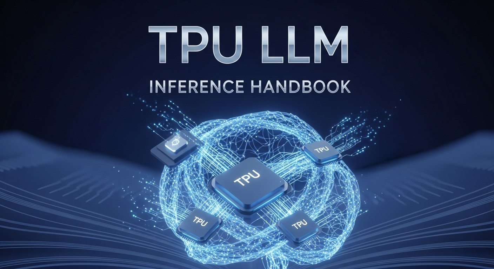

# TPU LLM Inference Handbook

[](https://tpu-llm.github.io/tpu-llm-inference-handbook/)

Welcome to the **TPU LLM Inference Handbook**! This is a comprehensive, hands-on guide designed to take you from the fundamentals of accelerated computing to deploying and scaling Large Language Models (LLMs) on Google's Tensor Processing Units (TPUs). This repository contains all the source code, scripts, and content for the book.

---

## Why This Handbook?

Running LLM like Gemma, Llama3, DeepSeek, or your own fined tuned models in production is a significant engineering challenge. TPUs offer state-of-the-art performance and cost-efficiency for these tasks. This handbook demystifies the process, providing a practical, step-by-step roadmap to bridge the gap between theory and real-world application.

## Who Is This For?

*   **Software and ML Engineers** looking to deploy and scale LLMs.
*   **Data Scientists** who want to understand the underlying infrastructure for high-performance inference.
*   **MLOps and Platform Engineers** responsible for building and maintaining ML systems.
*   Anyone curious about the practical application of Google's TPUs for AI workloads.

## What You Will Learn

This handbook is structured as a multi-part series that builds from first principles to production-grade solutions:

*   **Part 1: The Foundations of TPU Inference:** Understand the "why" behind TPUs and see a dramatic performance increase with a simple hands-on experiment.
*   **Part 2: High-Performance Inference with JetStream:** Deploy a full-scale LLM (Llama 3) on a single TPU VM using Google's purpose-built JetStream inference engine.
*   **Part 3: Scaling Llama on GKE with JetStream:** Take your deployment to the next level by scaling it across multiple nodes in a Google Kubernetes Engine (GKE) cluster.
*   **Part 4: High-Throughput Inference with vLLM on TPUs:** Explore the popular vLLM inference server and learn how to leverage its advanced features like PagedAttention on TPUs.
*   **Part 5: Production Readiness and Cost Optimization:** Learn the best practices for monitoring, logging, and optimizing your deployment for cost and reliability in a production environment.

## Repository Structure

This repository is a [Quarto](https://quarto.org/) book project. All content is written in markdown and is fully open for contribution.

*   `/*.qmd`: The source files for the Quarto book chapters.
*   `/code`: Contains the standalone Python scripts (e.g., `matrix_heartbeat_cpu.py`, `matrix_heartbeat_tpu.py`) used in the handbook.
*   `/images`: Stores all the diagrams and images used in the book.
*   `_quarto.yml`: The main configuration file for the Quarto book.

## Getting Started

The best way to get started is to read the handbook itself!

### **➡️ [Read the full handbook here](https://tpu-llm.github.io/tpu-llm-inference-handbook/) ⬅️**

To use the code from this repository locally:

1.  **Clone the repository:**
    ```bash
    git clone https://github.com/tpu-llm/tpu-llm-inference-handbook.git
    ```
2.  **Navigate to the project directory:**
    ```bash
    cd tpu-llm-inference-handbook
    ```
3.  Follow the instructions within each chapter of the handbook to run the corresponding code and scripts.

## Contributing

Contributions are welcome! If you find any issues, have suggestions for improvements, or want to add new content, please feel free to open an issue or submit a pull request.